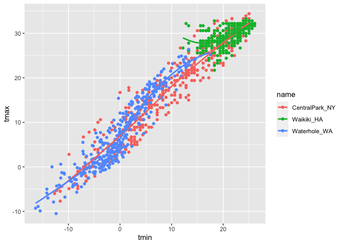

Visualization
================

``` r
library(tidyverse)
```

    ## ── Attaching packages ─────────────────────────────────────── tidyverse 1.3.2 ──
    ## ✔ ggplot2 3.3.6      ✔ purrr   0.3.4 
    ## ✔ tibble  3.1.8      ✔ dplyr   1.0.10
    ## ✔ tidyr   1.2.0      ✔ stringr 1.4.1 
    ## ✔ readr   2.1.2      ✔ forcats 0.5.2 
    ## ── Conflicts ────────────────────────────────────────── tidyverse_conflicts() ──
    ## ✖ dplyr::filter() masks stats::filter()
    ## ✖ dplyr::lag()    masks stats::lag()

``` r
library(ggridges)
```

## Load the weather data

We’ll be working with NOAA weather data, which is downloaded using
rnoaa::meteo_pull_monitors function in the code chunk below; similar
code underlies the weather dataset used elsewhere in the course. Because
this process can take some time, I’ll cache the code chunk:

``` r
weather_df = 
  rnoaa::meteo_pull_monitors(
    c("USW00094728", "USC00519397", "USS0023B17S"),
    var = c("PRCP", "TMIN", "TMAX"), 
    date_min = "2017-01-01",
    date_max = "2017-12-31") %>%
  mutate(
    name = recode(
      id, 
      USW00094728 = "CentralPark_NY", 
      USC00519397 = "Waikiki_HA",
      USS0023B17S = "Waterhole_WA"),
    tmin = tmin / 10,
    tmax = tmax / 10) %>%
  select(name, id, everything())
```

    ## Registered S3 method overwritten by 'hoardr':
    ##   method           from
    ##   print.cache_info httr

    ## using cached file: ~/Library/Caches/R/noaa_ghcnd/USW00094728.dly

    ## date created (size, mb): 2022-10-01 14:35:33 (8.406)

    ## file min/max dates: 1869-01-01 / 2022-09-30

    ## using cached file: ~/Library/Caches/R/noaa_ghcnd/USC00519397.dly

    ## date created (size, mb): 2022-10-01 14:35:41 (1.699)

    ## file min/max dates: 1965-01-01 / 2020-03-31

    ## using cached file: ~/Library/Caches/R/noaa_ghcnd/USS0023B17S.dly

    ## date created (size, mb): 2022-10-01 14:35:45 (0.95)

    ## file min/max dates: 1999-09-01 / 2022-09-30

## Scatterplots!

Create my first scatterplot ever

``` r
ggplot(weather_df, aes(x = tmin, y = tmax)) + 
  geom_point()
```

    ## Warning: Removed 15 rows containing missing values (geom_point).

<!-- -->

Same plot, new approach:

``` r
weather_df %>%
  ggplot(aes(x = tmin, y = tmax)) +
  geom_point()
```

    ## Warning: Removed 15 rows containing missing values (geom_point).

<!-- -->

Save and edit a plot object.

``` r
weather_plot =
  weather_df %>%
  ggplot(aes(x = tmin, y = tmax))

weather_plot + geom_point() #each item in ggplot treated as separate (+ signs between)
```

    ## Warning: Removed 15 rows containing missing values (geom_point).

<!-- -->

## Advanced S…

Start with the same scatterplot as above and make it fancy!

``` r
weather_df %>%
  ggplot(aes(x = tmin, y = tmax, color = name)) +
  geom_point() +
  geom_smooth(se = FALSE) #add smooth curves to data
```

    ## `geom_smooth()` using method = 'loess' and formula 'y ~ x'

    ## Warning: Removed 15 rows containing non-finite values (stat_smooth).

    ## Warning: Removed 15 rows containing missing values (geom_point).

<!-- -->

What about the `aes` placement…?

``` r
weather_df %>%
  ggplot(aes(x = tmin, y = tmax)) +
  geom_point(aes(color = name)) +
  geom_smooth()
```

    ## `geom_smooth()` using method = 'gam' and formula 'y ~ s(x, bs = "cs")'

    ## Warning: Removed 15 rows containing non-finite values (stat_smooth).

    ## Warning: Removed 15 rows containing missing values (geom_point).

<!-- --> When we define
color=name inside the geom_point call, geom_smooth plots one line for
all the data (rather than one line per color/city). This is because
color = name no longer applies to the entire plot, but to the scatter
points only. Defining aesthetics in ggplot() will define it everywhere
else, unless you take steps (as above) to change that.

Let’s facet some things!

``` r
weather_df %>%
  ggplot(aes(x = tmin, y = tmax, color = name)) +
  geom_point() +
  geom_smooth(se = FALSE) +
  facet_grid(. ~ name) #facet_grid(row definition ~ column definition) where . = none
```

    ## `geom_smooth()` using method = 'loess' and formula 'y ~ x'

    ## Warning: Removed 15 rows containing non-finite values (stat_smooth).

    ## Warning: Removed 15 rows containing missing values (geom_point).

<!-- -->

``` r
#separates graphs by defined variable

weather_df %>%
  ggplot(aes(x = tmin, y = tmax, color = name)) +
  geom_point() +
  geom_smooth(se = FALSE) +
  facet_grid(name ~ .) #same code with rows instead of columns
```

    ## `geom_smooth()` using method = 'loess' and formula 'y ~ x'

    ## Warning: Removed 15 rows containing non-finite values (stat_smooth).
    ## Removed 15 rows containing missing values (geom_point).

<!-- -->

``` r
weather_df %>%
  ggplot(aes(x = tmin, y = tmax, color = name)) +
  geom_point(alpha = .2, size = 1) + #customize transparency and size of points
  geom_smooth(se = FALSE, size = 2) + #customize size of line
  facet_grid(. ~ name) 
```

    ## `geom_smooth()` using method = 'loess' and formula 'y ~ x'

    ## Warning: Removed 15 rows containing non-finite values (stat_smooth).
    ## Removed 15 rows containing missing values (geom_point).

<!-- -->

``` r
weather_df %>%
  ggplot(aes(x = tmin, y = tmax, alpha = tmin, color = name)) + #set alpha to x in first line, transparency now depends on x. Can link aesthetics to variables here or define globally below.
  geom_point() + 
  geom_smooth(se = FALSE, size = 2)
```

    ## `geom_smooth()` using method = 'loess' and formula 'y ~ x'

    ## Warning: Removed 15 rows containing non-finite values (stat_smooth).
    ## Removed 15 rows containing missing values (geom_point).

<!-- -->

Let’s combine some elements and try a new plot:

``` r
weather_df %>%
  ggplot(aes(x = date, y = tmax, color = name)) +
  geom_point(aes(size = prcp), alpha = 0.5) + 
  geom_smooth(se = FALSE) + 
  facet_grid(. ~ name) 
```

    ## `geom_smooth()` using method = 'loess' and formula 'y ~ x'

    ## Warning: Removed 3 rows containing non-finite values (stat_smooth).

    ## Warning: Removed 3 rows containing missing values (geom_point).

<!-- -->

## Some small notes

How many geoms() have to exist?

You can have whatever geoms you want. For example, the chunk below maps
the curves but not the data points.

``` r
weather_df %>%
  ggplot(aes(x = tmin, y = tmax, color = name)) +
  geom_smooth(se = FALSE)
```

    ## `geom_smooth()` using method = 'loess' and formula 'y ~ x'

    ## Warning: Removed 15 rows containing non-finite values (stat_smooth).

<!-- -->

You can use a neat geom!

``` r
weather_df %>%
  ggplot(aes(x = tmin, y = tmax)) +
  geom_density2d() + #must install hexbin package to run
  geom_point(alpha = 0.3)
```

    ## Warning: Removed 15 rows containing non-finite values (stat_density2d).

    ## Warning: Removed 15 rows containing missing values (geom_point).

<!-- -->

``` r
#also: geom_hex() for 2d scatterplot with hexograms, geom_bin2d()), geom_density2d(), etc
```

## Univariate plots

### Histograms

Histograms are really great. Simple histogram:

``` r
weather_df %>%
  ggplot(aes(x = tmin)) +
  geom_histogram()
```

    ## `stat_bin()` using `bins = 30`. Pick better value with `binwidth`.

    ## Warning: Removed 15 rows containing non-finite values (stat_bin).

<!-- -->

Histogram with some fancy features:

``` r
weather_df %>%
  ggplot(aes(x = tmin, fill = name)) + #add color by city name
  geom_histogram(position = "dodge") + #separate bars instead of default overlaying
  facet_grid(. ~ name) #separates histograms to different grids
```

    ## `stat_bin()` using `bins = 30`. Pick better value with `binwidth`.

    ## Warning: Removed 15 rows containing non-finite values (stat_bin).

<!-- -->

### Density plots

Let’s try a new geometry! Density plots are like smooth histograms:

``` r
weather_df %>%
  ggplot(aes(x = tmin, fill = name)) +
  geom_density(alpha = 0.3) #transparency
```

    ## Warning: Removed 15 rows containing non-finite values (stat_density).

<!-- -->

### Box plots

``` r
weather_df %>%
  ggplot(aes(x = name, y = tmin)) + #display minimum temperature by city
  geom_boxplot()
```

    ## Warning: Removed 15 rows containing non-finite values (stat_boxplot).

<!-- -->

\###Trendy plots

Violin plots are good for visualizing skewed data:

``` r
weather_df %>%
  ggplot(aes(x = name, y = tmin, fill = name)) +
  geom_violin(alpha = 0.5) +
  stat_summary(fun = "median") #shows median. Default is mean and SD if undefined.
```

    ## Warning: Removed 15 rows containing non-finite values (stat_ydensity).

    ## Warning: Removed 15 rows containing non-finite values (stat_summary).

    ## Warning: Removed 3 rows containing missing values (geom_segment).

<!-- -->

Ridge plots were the trendiest plot of 2017, and were a replacement for
both boxplots and violin plots. They’re implemented in the ggridges
package, and are nice if you have lots of categories in which the shape
of the distribution matters.

``` r
ggplot(weather_df, aes(x = tmax, y = name)) + 
  geom_density_ridges(scale = .85)
```

    ## Picking joint bandwidth of 1.84

    ## Warning: Removed 3 rows containing non-finite values (stat_density_ridges).

<!-- -->

## Saving and embedding plots

You will, on occasion, need to save a plot to a specific file. Don’t use
the built-in “Export” button! If you do, your figure is not reproducible
– no one will know how your plot was exported. Instead, use ggsave() by
explicitly creating the figure and exporting; ggsave will guess the file
type you prefer and has options for specifying features of the plot. In
this setting, it’s often helpful to save the ggplot object explicitly
and then export it (using relative paths!).
